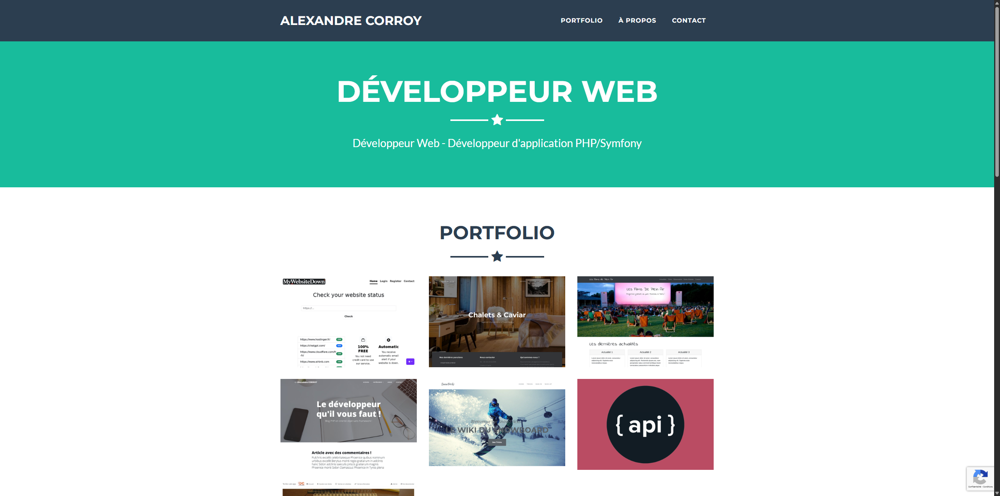

# Portfolio – Alexandre Corroy



Ce dépôt contient le code source de mon **site portfolio personnel**, développé avec **PHP, HTML, CSS et JavaScript**.  
Le site présente mes **compétences**, mon **expérience**, mes **projets** et sujets techniques liés au développement web et DevSecOps.

🔗 **Site en ligne :** [https://alexandrecorroy.fr](https://alexandrecorroy.fr)

---

## Technologies utilisées

### Langages & Frameworks
- **PHP 8.0**
- **HTML5 / CSS3**
- **JavaScript** (avec **jQuery**)
- **Bootstrap 4**
- **Font Awesome 5**

### Outils & Environnement
- **Git / GitHub** pour la gestion du code
- **PhpStorm** comme IDE principal
- **Docker** pour l’environnement de développement

---

## Installation et exécution avec Docker

### Prérequis
- **Docker** ≥ 20.10  
- **Docker Compose** ≥ 2.0

### 🚀 Lancer le projet

Clone le dépôt :
```bash
git clone https://github.com/alexandrecorroy/Portfolio.git
cd Portfolio
```

puis exécuter la commande suivante :

```bash
docker compose up -d --build
```

Ensuite, accederez au site en visitant l'adresse suivante : http://localhost:8080/

---

## À propos

Je suis Développeur PHP/Symfony et DevSecOps junior, avec plus de 15 ans d’expérience dans le web, dont 6 ans en développement PHP/Symfony et WordPress.
Je travaille aussi bien en freelance qu’en poste salarié (CDD/CDI).

Mon objectif est de continuer à progresser techniquement tout en concevant des solutions fiables, sécurisées et performantes.

## Contribution & retour

Les retours et suggestions sont les bienvenus !
Si tu découvres un bug ou souhaites proposer une amélioration, ouvre une issue sur GitHub.

Merci d’avoir pris le temps de visiter mon travail
– Alexandre Corroy